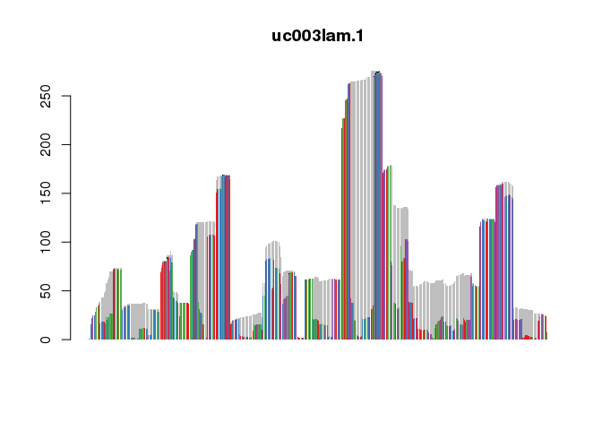

<!-- README.md is generated from README.Rmd. Please edit that file -->

# txtools

<!-- badges: start -->

<!-- badges: end -->

The goal of txtools is to …

## Installation

Install txtools dependencies with the following code

``` r
# CRAN packages
install.packages(c("magrittr", "stringr", "devtools"))
# Bioconductor packages
if (!requireNamespace("BiocManager", quietly = TRUE))
    install.packages("BiocManager")
BiocManager::install(c("GenomicRanges", "plyranges", "Rsamtools", "GenomicAlignments"))
```

Install the development version from [GitHub](https://github.com/) with:

``` r
# install.packages("devtools")
devtools::install_github("AngelCampos/testRepo")
BiocManager::install("AngelCampos/txtools")
```

## Demo

This is a basic example which shows you how to solve a common problem:

``` r
library(txtools)
# This example files are installed along txtools
bamFile <- system.file("extdata", "example_hg19.bam", package = "txtools")
bedFile <- system.file("extdata", "twoUCSCgenes_hg19.bed", package = "txtools")

reads <- load_pairedEnd_bam(bamFile, loadSeq = T, verbose = F)
#>   |                                                                              |                                                                      |   0%
#> Dumped reads due to ambiguous pairs: 0
geneAnnot <- plyranges::read_bed(bedFile) # plyranges read_bed function
txReads <- tx_PEreads(reads, geneAnnot, withSeq = T)
#> Processing 2530 reads, using 2 gene models 
#> 2509 paired-end reads overlap 2 gene models 
#> Filtering reads by gene model... 
#> Processing sequences. This may take several minutes... 
#> Output contains: 1676 unique reads in 2 gene models
txReads$uc003lam.1
#> GRanges object with 1622 ranges and 1 metadata column:
#>                            seqnames    ranges strand |
#>                               <Rle> <IRanges>  <Rle> |
#>   ID38046662_GCT_CCTATAT uc003lam.1 1813-1918      - |
#>   ID28233543_TCA_CCTATAT uc003lam.1 1784-1918      - |
#>   ID28233549_TCA_CCTATAT uc003lam.1 1784-1918      - |
#>   ID13461013_GGA_CCTATAT uc003lam.1 1781-1924      - |
#>   ID16878801_GTA_CCTATAT uc003lam.1 1781-1868      - |
#>                      ...        ...       ...    ... .
#>   ID53343997_AGA_CCTATAT uc003lam.1     8-139      - |
#>    ID9459288_TGC_CCTATAT uc003lam.1     8-139      - |
#>   ID43960170_ACC_CCTATAT uc003lam.1     4-139      - |
#>   ID10702999_CCC_CCTATAT uc003lam.1     3-139      - |
#>   ID34387939_TTA_CCTATAT uc003lam.1     1-139      - |
#>                                                                                                                                                                       seq
#>                                                                                                                                                               <character>
#>   ID38046662_GCT_CCTATAT                                       TTGATGGATTTGAAAATGAAAGATTTAAAAAGGCAAA................................TTTGGAATTTGTGTGAGTTGATTTAGTATAATGTTAA
#>   ID28233543_TCA_CCTATAT          GACCTAATTTTTGGTTACTTTTTGTCTTATTGATGG..............................................................TTTGGAATTTGTGTGAGTTGATTTAGTAAAATGTTAA
#>   ID28233549_TCA_CCTATAT          GACCTAATTTTTGGTTACTTTTTGTCTTATTGATGG..............................................................TTTGGAATTTGTGTGAGTTGATTTAGTAAAATGTTAA
#>   ID13461013_GGA_CCTATAT ACAGACCTAATTTTTGGTTACTTTTTGTCTTATTGAT..........................................................................GTGTGAGTTGATTTAGTAAAATGTTAAACCGTT
#>   ID16878801_GTA_CCTATAT                                                         ACAGACCTAATTTTTGGTTACTTTTTGTCTTATTGAT..............AAGATTTAATAAGGCAAAGCAGAATCTGTTGTCCTTA
#>                      ...                                                                                                                                              ...
#>   ID53343997_AGA_CCTATAT             CCAGTTCACTCGGCAGCGGCGCCGGGCGGAGGGGGA...........................................................AGAAAAGGCGCGAGCGGCCAGGAGGGCTCAGGCCGAG
#>    ID9459288_TGC_CCTATAT             CCAGTTCACTCGGCAGCGGCGCCGGGCGGAGGGGGA...........................................................AGAAAAGGCGCGAGCGGCCAGGAGGGCTCAGGCCGAG
#>   ID43960170_ACC_CCTATAT         GGTTCCAGTTCACTCGGCAGCGGCGCCGGGCGGAGGG..............................................................AGAAAAGGCGCGAGCGGCCAGGAGGGCTCAGGCCGAG
#>   ID10702999_CCC_CCTATAT        TGGTTCCAGTTCACTCGGCAGCGGCGCCGGGCGGAGG...............................................................AGAAAAGGCGCGAGGGGCCAGGAGGGCTCAGGCCGAG
#>   ID34387939_TTA_CCTATAT      ACTGGTTCCAGTTCACTCGGCAGCGGCGCCGGGCGGA.................................................................AGAAAAGGCGCGAGCGGCCAGGAGGGCTCAGGCCGAG
#>   -------
#>   seqinfo: 1 sequence from an unspecified genome
```

The main object

``` r
library(magrittr) # %>% Pipe operator 

resTab <- hlp_cbind3Tabs(tx_genCoorTab(txReads, geneAnnot),
                         tx_covTab(txReads),
                         tx_nucFreqTab(txReads, simplify_IUPAC = "splitForceInt"))

resTab$uc003lam.1[,..IUPAC_code_simpl] %>% data.frame() %>% t %>% 
    barplot(col = c(RColorBrewer::brewer.pal(4, "Set1"), 
                    "black", "white", "gray"), border = NA, main= "uc003lam.1")
```


