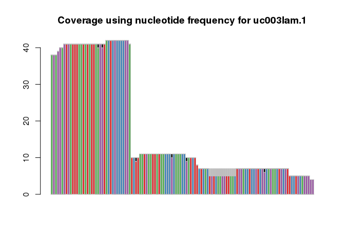

<!-- README.md is generated from README.Rmd. Please edit that file -->

# txtools

<!-- badges: start -->

<!-- badges: end -->

**txtools** is a package that processes GenomicAlignments into
transcriptomic versions

## Installation

Install the development version from [GitHub](https://github.com/) with:

``` r
# install.packages("devtools")
devtools::install_github("AngelCampos/txtools")
# install.packages("BiocManager")
BiocManager::install("AngelCampos/txtools")
```

## Demo

The main input that we want to process are Genomic Alignments from **BAM
files**, into their transcriptomic homologues. To do this we require
gene models provided in the form of **BED files**.

In this basic example we use data provided within **txtools**.

We first load the BAM file and the BED file’s gene models. Then apply
the `tx_PEreads()` function to the reads and select to use the sequence.

``` r
library(txtools)
library(magrittr) # %>% Pipe operator 

# This example files are installed along txtools
bamFile <- system.file("extdata", "example_hg19.bam", package = "txtools")
bedFile <- system.file("extdata", "twoUCSCgenes_hg19.bed", package = "txtools")

# Loading files and processing them using the gene models
reads <- load_pairedEnd_bam(bamFile, loadSeq = T, verbose = F)
geneAnnot <- plyranges::read_bed(bedFile) # plyranges read_bed function
txReads <- tx_PEreads(reads, geneAnnot, withSeq = T, verbose = F) %>% 
    tx_filter_max_width(500) # Filter out transcripts longer than 500 bases
```

`txReads` will contain all reads that matched the gene models and their
respective sequences.

``` r
names(txReads)
#> [1] "uc003lam.1" "uc010nap.1"
txReads$uc010nap.1$seq[6]
#> [1] "ACAAGGATGGAAGAGGCCCTCGGGCCTGACAACACGC.............ATTGCCACCTACTTCGTGGCATCTAACCATCGTTTTT"
```

The object is of class GenomicRanges but its coordinates belong to the
used transcriptomic reference.

-----

Another useful representation of RNA-seq information is to summarise
reads into tables that span the whole transcript in order to extract
useful information as:

  - Coverage
  - Starts or 5prime-ends counts
  - Ends or 3prime-ends counts
  - Nucleotide frequencies
  - Deletion frequencies

<!-- end list -->

``` r
resTab <- hlp_cbind3Tabs(tx_genCoorTab(txReads, geneAnnot),
                         tx_covTab(txReads),
                         tx_nucFreqTab(txReads, simplify_IUPAC = "splitForceInt"))
resTab$uc010nap.1[,-"."]
#>       chr   gencoor strand       gene txcoor cov start_5p end_3p A C  G  T N -
#>   1: chr9 137029686      - uc010nap.1      1  38       38      0 0 0 38  0 0 0
#>   2: chr9 137029685      - uc010nap.1      2  38        0      0 0 0  0 38 0 0
#>   3: chr9 137029684      - uc010nap.1      3  38        0      0 0 0 38  0 0 0
#>   4: chr9 137029683      - uc010nap.1      4  39        1      0 0 0  0 39 0 0
#>   5: chr9 137029682      - uc010nap.1      5  40        1      0 0 0  0 40 0 0
#>  ---                                                                          
#> 121: chr9 137029566      - uc010nap.1    121   5        0      0 0 0  0  5 0 0
#> 122: chr9 137029565      - uc010nap.1    122   5        0      0 0 0  0  5 0 0
#> 123: chr9 137029564      - uc010nap.1    123   5        0      1 0 0  0  5 0 0
#> 124: chr9 137029563      - uc010nap.1    124   4        0      0 0 0  0  4 0 0
#> 125: chr9 137029562      - uc010nap.1    125   4        0      4 0 0  0  4 0 0
```

A graphical representation can be done to represent coverage using the
nucleotide frequency tables

``` r
resTab$uc010nap.1[,..IUPAC_code_simpl] %>% data.frame() %>% t %>% 
    barplot(col = c(RColorBrewer::brewer.pal(4, "Set1"), 
                    "black", "white", "gray"), border = "gray",
            main= "Coverage using nucleotide frequency for uc003lam.1")
```


