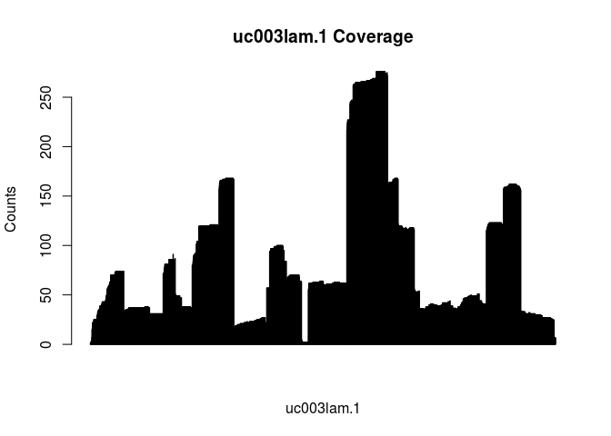
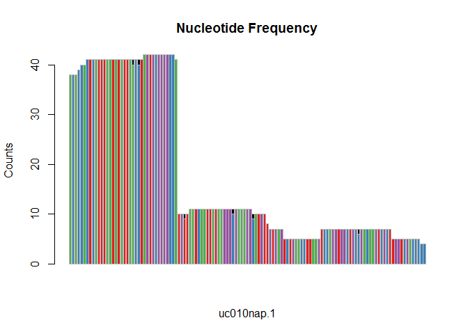

# txtools

<!-- badges: start -->

<!-- badges: end -->

**txtools** is a package that processes GenomicAlignments objects into
their transcriptomic versions.

**txtools** is meant to expand the functionality of the
[**GenomicAlignments**](https://bioconductor.org/packages/release/bioc/html/GenomicRanges.html)
package, as currently it does not support transcriptomic-wise features.
Transcriptomic-wise or gene-models-aware featuresare increasingly needed
to process and analyze RNA-seq data in which transcript-structure and
close nucleotide-level inspection is required.

## Installation

You can install the development version from
[GitHub](https://github.com/) with:

``` r
if (!requireNamespace("BiocManager", quietly = TRUE))
    install.packages("BiocManager")

BiocManager::install("AngelCampos/txtools")
```

## Demo

### From genomic to transcriptomic

The main input that we want to process are Genomic Alignments from **BAM
files**, into their transcriptomic homologues. To do this we require
gene models provided in the form of **BED-12 or BED-6 files**.

In this basic example we use data provided within **txtools**.

We first load the BAM file we want to process and the BED file’s gene
models, using the `tx_load_bam()` and `tx_load_bed()` functions.

``` r
# Load packages
library(txtools)

# This example files are installed along txtools
bamFile <- system.file("extdata", "example_hg19.bam", package = "txtools")
bedFile <- system.file("extdata", "twoUCSCgenes_hg19.bed", package = "txtools")

# Loading files and processing them using the gene models
reads <- tx_load_bam(bamFile, loadSeq = T, verbose = T, yieldSize = 10000)
#> Reading number of records in file 
#> 5061 number of BAM records 
#> Loading BAM file 
#>   |                                                                              |                                                                      |   0%  |                                                                              |======================================================================| 100%
#>  
#> 2530 reads succesfully loaded 
#> Dumped reads due to ambiguous pairs: 0
geneAnnot <- tx_load_bed(bedFile) # plyranges read_bed function
```

The object `reads` now contains the aligned **genomic** reads,
previously aligned with commonly used genomic aligners. Sorted BAM files
make processing faster, see [samtools
sort](https://www.htslib.org/doc/samtools-sort.html) for more info on
this.

For converting our loaded genomic reads to **transcriptomic** reads we
use the `tx_reads()`. Importantly, the function will assign mappings to
their corresponding genes ONLY if they are consistent with the exon
structure of the gene model. This allows to distinguish reads between
different gene isoforms.

``` r
txReads <- tx_reads(reads, geneAnnot, withSeq = T, verbose = T)
#> Processing 2530 reads, using 2 gene models 
#> 2509 paired-end reads overlap 2 gene models 
#> Filtering reads by gene model... 
#> Processing sequences. This may take several minutes... 
#> Output contains: 1676 unique reads in 2 gene models
# txReads <- tx_reads_mc(reads, geneAnnot, nCores = 2,
                       # withSeq = T, verbose = T) # Multicore option
```

Currently, txtools is designed for and requires RNA-seq libraries that
are **strand-specific**.

**To accelerate processing the multi-core function** `tx_reads_mc()`
**is available for UNIX systems**

### Compatibility with GenomicRanges

Now `txReads` contains a list with all paired-end RNA-seq mappings
divided by their corresponding gene models, along with their sequences
as specified in the call to `tx_reads()`.

The resulting object is a GenomicRangesList (*GRangesList*) a list that
contains *GenomicRanges* the core object of their homonymous package,
but their coordinates belong now to the transcriptomic references used.
In this way we can take advantage of **GenomicRanges** functions and
accesors to retrieve information from the mappings, and manipulate them.

For example:

  - The start of reads

<!-- end list -->

``` r
GenomicRanges::start(txReads)
#> IntegerList of length 2
#> [["uc003lam.1"]] 1813 1784 1784 1781 1781 1781 1781 1781 ... 8 8 7 8 8 4 3 1
#> [["uc010nap.1"]] 70 70 70 70 70 39 39 39 43 39 39 39 ... 1 1 1 1 1 1 1 1 1 1 1
```

  - Extracting the ranges of the mappings for an specific gene using the
    `@ranges` operator

<!-- end list -->

``` r
txReads$uc003lam.1@ranges # Ranges of reads in transcriptomic space
#> IRanges object with 1622 ranges and 0 metadata columns:
#>                              start       end     width
#>                          <integer> <integer> <integer>
#>   ID38046662_GCT_CCTATAT      1813      1918       106
#>   ID28233543_TCA_CCTATAT      1784      1918       135
#>   ID28233549_TCA_CCTATAT      1784      1918       135
#>   ID13461013_GGA_CCTATAT      1781      1924       144
#>   ID16878801_GTA_CCTATAT      1781      1868        88
#>                      ...       ...       ...       ...
#>   ID53343997_AGA_CCTATAT         8       139       132
#>    ID9459288_TGC_CCTATAT         8       139       132
#>   ID43960170_ACC_CCTATAT         4       139       136
#>   ID10702999_CCC_CCTATAT         3       139       137
#>   ID34387939_TTA_CCTATAT         1       139       139
```

  - Extracting meta columns, with additional data, using the mcols()
    function. In this case, we extract the values for the 6th mapping of
    the ‘uc010nap.1’ gene.

<!-- end list -->

``` r
GenomicRanges::mcols(txReads$uc010nap.1)[6,]
#> [1] "ACAAGGATGGAAGAGGCCCTCGGGCCTGACAACACGC.............ATTGCCACCTACTTCGTGGCATCTAACCATCGTTTTT"
```

Although using GenomicRanges functions may be useful in some cases for
user specific tasks, txtools contains several functions that allow
further processing and manipulation of the resulting transcriptomic
mappings, and are shown in the next sections.

### Raw Gene Counts

A common task in RNA-seq analysis workflows is simply counting the reads
(or mappings) that fall into a gene model to calculate gene expression
levels. We can easily calculate that for all the genes using the
`tx_counts()` function.

``` r
tx_counts(txReads)
#> .
#> uc003lam.1 uc010nap.1 
#>       1622         54
```

### Filtering

To control for spurious mappings we can filter for too long mappings,
now in the transcriptomic space, with the `tx_filter_max_width()`
function. In this example we set the threshold to 500, removing mappings
longer than 500 nucleotides at the transcript level.

``` r
txReads <- tx_filter_max_width(txReads, 300) # Filter out transcripts longer than 500 bases
tx_counts(txReads)
#> .
#> uc003lam.1 uc010nap.1 
#>       1602         54
```

### Summarizing reads into data.tables (DT)

A useful representation of RNA-seq information we came up with is to
summarise read metrics into tables spanning the whole transcript with
information per nucleotide. Currently the metrics that we extract are
the following:

  - Coverage
  - Starts or 5’-ends counts
  - Ends or 3’-ends counts
  - Nucleotide frequencies
  - Deletion frequencies

txtools provides three main functions to calculate all or parts of this
information:

  - `tx_coverageDT()`: Calculates coverage, read-starts, and read-ends
    counts.

<!-- end list -->

``` r
resTab1 <- tx_coverageDT(txReads, geneAnnot)
resTab1[[1]]
#>        chr   gencoor strand       gene txcoor cov start_5p end_3p
#>    1: chr5 134734928      - uc003lam.1      1   1        1      0
#>    2: chr5 134734927      - uc003lam.1      2   1        0      0
#>    3: chr5 134734926      - uc003lam.1      3   2        1      0
#>    4: chr5 134734925      - uc003lam.1      4   3        1      0
#>    5: chr5 134734924      - uc003lam.1      5   3        0      0
#>   ---                                                            
#> 1920: chr5 134670075      - uc003lam.1   1920   7        0      0
#> 1921: chr5 134670074      - uc003lam.1   1921   7        0      0
#> 1922: chr5 134670073      - uc003lam.1   1922   7        0      0
#> 1923: chr5 134670072      - uc003lam.1   1923   7        0      1
#> 1924: chr5 134670071      - uc003lam.1   1924   6        0      6
```

  - `tx_nucFreqDT()`: Calculates the nucleotide frequency pileup.

<!-- end list -->

``` r
resTab2 <- tx_nucFreqDT(txReads, geneAnnot)
resTab2[[1]]
#>        chr   gencoor strand       gene txcoor A C G T N - .
#>    1: chr5 134734928      - uc003lam.1      1 1 0 0 0 0 0 0
#>    2: chr5 134734927      - uc003lam.1      2 0 1 0 0 0 0 0
#>    3: chr5 134734926      - uc003lam.1      3 0 0 0 2 0 0 0
#>    4: chr5 134734925      - uc003lam.1      4 0 0 3 0 0 0 0
#>    5: chr5 134734924      - uc003lam.1      5 0 0 3 0 0 0 0
#>   ---                                                      
#> 1920: chr5 134670075      - uc003lam.1   1920 0 7 0 0 0 0 0
#> 1921: chr5 134670074      - uc003lam.1   1921 0 7 0 0 0 0 0
#> 1922: chr5 134670073      - uc003lam.1   1922 0 0 7 0 0 0 0
#> 1923: chr5 134670072      - uc003lam.1   1923 0 0 0 7 0 0 0
#> 1924: chr5 134670071      - uc003lam.1   1924 0 0 0 6 0 0 0
```

  - `tx_coverageDT()`: Calculates all previous (coverage, read-starts
    counts, and read-ends counts, and nucleotide frequency).

<!-- end list -->

``` r
resTab3 <- tx_covNucFreqDT(txReads, geneAnnot)
resTab3[[1]]
#>        chr   gencoor strand       gene txcoor cov start_5p end_3p A C G T N - .
#>    1: chr5 134734928      - uc003lam.1      1   1        1      0 1 0 0 0 0 0 0
#>    2: chr5 134734927      - uc003lam.1      2   1        0      0 0 1 0 0 0 0 0
#>    3: chr5 134734926      - uc003lam.1      3   2        1      0 0 0 0 2 0 0 0
#>    4: chr5 134734925      - uc003lam.1      4   3        1      0 0 0 3 0 0 0 0
#>    5: chr5 134734924      - uc003lam.1      5   3        0      0 0 0 3 0 0 0 0
#>   ---                                                                          
#> 1920: chr5 134670075      - uc003lam.1   1920   7        0      0 0 7 0 0 0 0 0
#> 1921: chr5 134670074      - uc003lam.1   1921   7        0      0 0 7 0 0 0 0 0
#> 1922: chr5 134670073      - uc003lam.1   1922   7        0      0 0 0 7 0 0 0 0
#> 1923: chr5 134670072      - uc003lam.1   1923   7        0      1 0 0 0 7 0 0 0
#> 1924: chr5 134670071      - uc003lam.1   1924   6        0      6 0 0 0 6 0 0 0
```

The resulting object is of class `data.table`. A fast and memory
efficient relative to the data.frame.

The resulting data.table enables easy and fast access to data, ready for
manipulation and analysis, for example, creating a barplot with the
coverage column:

  - Coverage barplot

<!-- end list -->

``` r
iGene <- "uc003lam.1"
barplot(resTab3[[iGene]]$cov, main = paste(iGene, "Coverage"),
        ylab = "Counts", xlab = iGene)
```



  - Nucleotide frequency barplot

<!-- end list -->

``` r
iGene <- "uc010nap.1"
barplot(t(data.frame(resTab3[[iGene]][,c("A", "T", "G", "C", "N")])),
        col = c("#E41A1C", "#377EB8", "#4DAF4A", "#984EA3", "black"), border = "gray",
        main = paste("Nucleotide Frequency"), ylab = "Counts", xlab = iGene)
```



### Aggregating and splitting data.tables

Some features of data.tables can be only taken advantage when merging
all the data of the genes into one single data.table, we can do this
with the `tx_merge_DT()` function. Similarly going back to gene
independent data tables is done with the `tx_split_DT()` function.

``` r
# Merge
mergedDT <- tx_merge_DT(resTab1)
class(mergedDT)
#> [1] "data.table" "data.frame"
# Split
split_DT <- tx_split_DT(mergedDT)
class(split_DT)
#> [1] "list"
summary(split_DT)
#>            Length Class      Mode
#> uc003lam.1 8      data.table list
#> uc010nap.1 8      data.table list
```

A nice example of using data.tables is the x\[i, j, by\] syntax, which
can be used to apply functions to groups of values in the data.table.
For example, using the **merged data.table** we can calculate the median
coverage per gene.

``` r
mergedDT[,median(cov), by = gene]
#>          gene V1
#> 1: uc003lam.1 61
#> 2: uc010nap.1 10
```

We can see that the median coverage of “uc003lam.1” is 61 and for
“uc010nap.1” is 10.

### Adding the reference sequence to the DT

When working with transcriptomic data one would like to easily get the
relevant sequence. To add this info to a DT simply use the
`tx_add_refSeqDT()` function.

Preparation: To use the `tx_add_refSeqDT()` function we need a reference
genome. In this case we use a BSgenome, a collection of pre-packaged
genomes for easy installation. In this case we will use the BSgenome for
human “BSgenome.Hsapiens.UCSC.hg19”.

``` r
# BiocManager::install("BSgenome.Hsapiens.UCSC.hg19") # Uncomment if you need to install
# Loading reference genome
genome <- BSgenome.Hsapiens.UCSC.hg19::BSgenome.Hsapiens.UCSC.hg19
# Adding the reference sequence to the summarized DT object
newDT <- tx_add_refSeqDT(resTab1$uc003lam.1, genome, geneAnnot)
newDT
#>        chr   gencoor strand       gene txcoor refSeq cov start_5p end_3p
#>    1: chr5 134734928      - uc003lam.1      1      A   1        1      0
#>    2: chr5 134734927      - uc003lam.1      2      C   1        0      0
#>    3: chr5 134734926      - uc003lam.1      3      T   2        1      0
#>    4: chr5 134734925      - uc003lam.1      4      G   3        1      0
#>    5: chr5 134734924      - uc003lam.1      5      G   3        0      0
#>   ---                                                                   
#> 1920: chr5 134670075      - uc003lam.1   1920      C   7        0      0
#> 1921: chr5 134670074      - uc003lam.1   1921      C   7        0      0
#> 1922: chr5 134670073      - uc003lam.1   1922      G   7        0      0
#> 1923: chr5 134670072      - uc003lam.1   1923      T   7        0      1
#> 1924: chr5 134670071      - uc003lam.1   1924      T   6        0      6
```

### Writing individual DTs to files

Additionally, storing the tables in a file for later use can be done
using the **data.table** package, which allows for fast writing of data
tables using the function `fwrite()`

``` r
# Writes datatable to file
data.table::fwrite(mergedDT, "tableName.txt", sep = "\t")
```

## Soon to come features:

  - **Complete function documentation & manual**
  - **How to use guide and practical cases**
  - **Graphical representations functions**
      - Coverage
      - Nucleotide frequency
      - Gene model ideogram
  - **Whole Transcript reconstruction**
  - **Meta-gene analysis tools**
      - Meta-gene plots

-----

## Current limitations:

  - Paired-end strand specific RNA-seq libraries: State of the art
    paired-end RNA-seq protocols provide strand awareness from the
    original RNA. Currently txtools is designed for such libraries,
    future improvements will enable processing of RNA-seq libraries
    which are not strand-aware nor paired-end.

  - Insertions: txtools is not able to deal with insertions. This is
    mainly because insertions are not part of the original
    trasncriptomic reference space as they would alter the length of the
    gene model. This could be fixed in future versions but is not a
    priority.

  - High processing time: Loading BAM files into R commonly requires a
    lot of time, having this in mind txtools provides a progress bar to
    keep users informed about the loading status. Also, depending on the
    ammount of both loaded reads and the size of the *Gene Annotation*
    tx\_reads() processing time can take several minutes. We will work
    hard to take this processing time as low as possible in future
    versions.

## Additional notes:

  - As many R packages meant for high-throughput data manipulation and
    analysis, using ***txtools*** may require high ammounts of RAM
    memory, mainly depending on the size of BAM files loaded.

## Session Info

``` r
utils::sessionInfo()
#> R version 3.6.3 (2020-02-29)
#> Platform: x86_64-w64-mingw32/x64 (64-bit)
#> Running under: Windows 10 x64 (build 10240)
#> 
#> Matrix products: default
#> 
#> locale:
#> [1] LC_COLLATE=English_United States.1252 
#> [2] LC_CTYPE=English_United States.1252   
#> [3] LC_MONETARY=English_United States.1252
#> [4] LC_NUMERIC=C                          
#> [5] LC_TIME=English_United States.1252    
#> 
#> attached base packages:
#> [1] stats     graphics  grDevices utils     datasets  methods   base     
#> 
#> other attached packages:
#> [1] txtools_0.0.0.9000
#> 
#> loaded via a namespace (and not attached):
#>  [1] Rcpp_1.0.4                        pillar_1.4.3                     
#>  [3] compiler_3.6.3                    GenomeInfoDb_1.22.1              
#>  [5] XVector_0.26.0                    bitops_1.0-6                     
#>  [7] tools_3.6.3                       zlibbioc_1.32.0                  
#>  [9] digest_0.6.25                     BSgenome_1.54.0                  
#> [11] lifecycle_0.2.0                   tibble_3.0.1                     
#> [13] evaluate_0.14                     lattice_0.20-38                  
#> [15] pkgconfig_2.0.3                   rlang_0.4.5                      
#> [17] Matrix_1.2-18                     DelayedArray_0.12.2              
#> [19] yaml_2.2.1                        parallel_3.6.3                   
#> [21] xfun_0.13                         GenomeInfoDbData_1.2.2           
#> [23] rtracklayer_1.46.0                stringr_1.4.0                    
#> [25] dplyr_0.8.5                       knitr_1.28                       
#> [27] vctrs_0.2.4                       Biostrings_2.54.0                
#> [29] plyranges_1.6.10                  S4Vectors_0.24.3                 
#> [31] IRanges_2.20.2                    tidyselect_1.0.0                 
#> [33] stats4_3.6.3                      grid_3.6.3                       
#> [35] data.table_1.12.8                 glue_1.3.2                       
#> [37] Biobase_2.46.0                    R6_2.4.1                         
#> [39] BSgenome.Hsapiens.UCSC.hg19_1.4.0 XML_3.99-0.3                     
#> [41] BiocParallel_1.20.1               rmarkdown_2.1                    
#> [43] purrr_0.3.3                       magrittr_1.5                     
#> [45] ellipsis_0.3.0                    Rsamtools_2.2.3                  
#> [47] htmltools_0.4.0                   matrixStats_0.56.0               
#> [49] BiocGenerics_0.32.0               GenomicRanges_1.38.0             
#> [51] GenomicAlignments_1.22.1          assertthat_0.2.1                 
#> [53] SummarizedExperiment_1.16.1       stringi_1.4.6                    
#> [55] RCurl_1.98-1.1                    crayon_1.3.4
```
