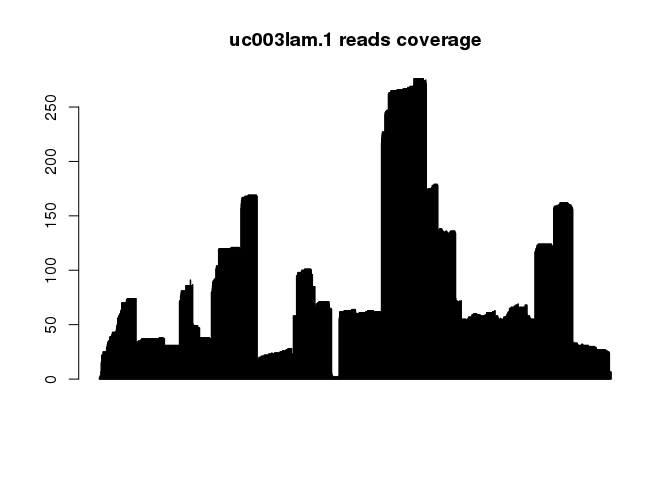
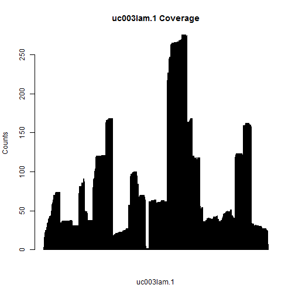

# txtools

<!-- badges: start -->

<!-- badges: end -->

**txtools** is a package that processes GenomicAlignments into their
transcriptomic versions.

**txtools** is meant to expand the functionality of the
[**GenomicAlignments**](https://bioconductor.org/packages/release/bioc/html/GenomicRanges.html)
package, as currently it does not suppot transcriptomic convertion,
which is being increasingly needed to process and analyze RNA-seq data
as we closely inspect the reads that diverse RNA-seq-based methodologies
provide.

## Installation

Install the development version from [GitHub](https://github.com/) with:

``` r
if (!requireNamespace("BiocManager", quietly = TRUE))
    install.packages("BiocManager")

BiocManager::install("AngelCampos/txtools")
```

## Demo

### Starting point `tx_reads()`

The main input that we want to process are Genomic Alignments from **BAM
files**, into their transcriptomic homologues. To do this we require
gene models provided in the form of **BED-12 files**.

In this basic example we use data provided within **txtools**.

We first load the BAM file and the BED file’s gene models.

``` r
# Load packages
library(txtools)

# This example files are installed along txtools
bamFile <- system.file("extdata", "example_hg19.bam", package = "txtools")
bedFile <- system.file("extdata", "twoUCSCgenes_hg19.bed", package = "txtools")

# Loading files and processing them using the gene models
reads <- tx_load_bam(bamFile, loadSeq = T, verbose = F)
geneAnnot <- tx_load_bed(bedFile) # plyranges read_bed function
```

Then we use the `tx_reads()` function to process the genomic alignments
into transcriptomic versions. txtools uses will assign mappings to their
corresponding genes only if they are overlapping their genomic regions
AND if they are consistent with the exon structure of the gene model,
perfectly distinguishing isoforms.

Currently that means that txtools is designed for and requires RNA-seq
libraries that are strand-specific.

<span style="background-color: #B3F2FF">*To accelerate processing the
multi-core* *function* `tx_reads_mc()` *is available for UNIX
systems*</span>

To control for spurious mappings we can filter for too long mappings, in
this case we set the threshold to 500, just to show an example.

``` r
txReads <- tx_reads(reads, geneAnnot, withSeq = T, verbose = T)
#> Processing 2530 reads, using 2 gene models 
#> 2509 paired-end reads overlap 2 gene models 
#> Filtering reads by gene model... 
#> Processing sequences. This may take several minutes... 
#> Output contains: 1676 unique reads in 2 gene models
txReads <- tx_filter_max_width(txReads, 500) # Filter out transcripts longer than 500 bases
```

Now `txReads` contains a list with all paired-end RNA-seq mappings
divided by their corresponding gene models, along their sequences as
specified in the call to `tx_reads()`.

The resulting object is a GenomicRangesList (*GRangesList*) a list that
contains *GenomicRanges* the core object of their homonymous package,
but their coordinates belong now to the transcriptomic references used.

In this way we can take advantage of **GenomicRanges** functions and
operators to retrieve information from the mappings.

For example:

  - The names of the gene models in the list

<!-- end list -->

``` r
names(txReads)
#> [1] "uc003lam.1" "uc010nap.1"
```

  - The ranges of the mappings for an specific gene

<!-- end list -->

``` r
txReads$uc003lam.1@ranges # Ranges of reads in transcriptomic space
#> IRanges object with 1622 ranges and 0 metadata columns:
#>                              start       end     width
#>                          <integer> <integer> <integer>
#>   ID38046662_GCT_CCTATAT      1813      1918       106
#>   ID28233543_TCA_CCTATAT      1784      1918       135
#>   ID28233549_TCA_CCTATAT      1784      1918       135
#>   ID13461013_GGA_CCTATAT      1781      1924       144
#>   ID16878801_GTA_CCTATAT      1781      1868        88
#>                      ...       ...       ...       ...
#>   ID53343997_AGA_CCTATAT         8       139       132
#>    ID9459288_TGC_CCTATAT         8       139       132
#>   ID43960170_ACC_CCTATAT         4       139       136
#>   ID10702999_CCC_CCTATAT         3       139       137
#>   ID34387939_TTA_CCTATAT         1       139       139
```

  - Sequences from an individual mapping in the gene

<!-- end list -->

``` r
txReads$uc010nap.1$seq[6] 
#> [1] "ACAAGGATGGAAGAGGCCCTCGGGCCTGACAACACGC.............ATTGCCACCTACTTCGTGGCATCTAACCATCGTTTTT"
```

### Raw Gene Counts

A common task in RNA-seq analysis workflows is simply counting the reads
(or mappings) that fall into a gene model. This can be done using the
`tx_counts()` function.

``` r
tx_counts(txReads)
#> .
#> uc003lam.1 uc010nap.1 
#>       1622         54
```

### RNA-seq reads summary tables

Another useful representation of RNA-seq information is to summarise
reads metrics into tables spanning the whole transcript with information
per nucleotide. The `tx_covNucFreqDT()` function creates such tables
adding both the genomic and transcriptomic coordinates system and the
following metrics:

  - Coverage
  - Starts or 5’-ends counts
  - Ends or 3’-ends counts
  - Nucleotide frequencies
  - Deletion frequencies

<!-- end list -->

``` r
resTab <- tx_covNucFreqDT(txReads, geneAnnot)

# This will show the summarized data table for the "uc010nap.1" gene
resTab$uc010nap.1
#>       chr   gencoor strand       gene txcoor cov start_5p end_3p A C  G  T N -
#>   1: chr9 137029686      - uc010nap.1      1  38       38      0 0 0 38  0 0 0
#>   2: chr9 137029685      - uc010nap.1      2  38        0      0 0 0  0 38 0 0
#>   3: chr9 137029684      - uc010nap.1      3  38        0      0 0 0 38  0 0 0
#>   4: chr9 137029683      - uc010nap.1      4  39        1      0 0 0  0 39 0 0
#>   5: chr9 137029682      - uc010nap.1      5  40        1      0 0 0  0 40 0 0
#>  ---                                                                          
#> 121: chr9 137029566      - uc010nap.1    121   5        0      0 0 0  0  5 0 0
#> 122: chr9 137029565      - uc010nap.1    122   5        0      0 0 0  0  5 0 0
#> 123: chr9 137029564      - uc010nap.1    123   5        0      1 0 0  0  5 0 0
#> 124: chr9 137029563      - uc010nap.1    124   4        0      0 0 0  0  4 0 0
#> 125: chr9 137029562      - uc010nap.1    125   4        0      4 0 0  0  4 0 0
#>      .
#>   1: 0
#>   2: 0
#>   3: 0
#>   4: 0
#>   5: 0
#>  ---  
#> 121: 0
#> 122: 0
#> 123: 0
#> 124: 0
#> 125: 0
```

The resulting object is of class `data.table`, as one can perform many
tasks using this data structure, as well as writing them to disk in a
faster way than using the base R functions.

The resulting data.table enables easy and fast access to data, ready for
manipulation and analysis, for example, creating a barplot with the
coverage column:

  - Coverage barplot

<!-- end list -->

``` r
iGene <- "uc003lam.1"
barplot(resTab[[iGene]]$cov, main = paste(iGene, "Coverage"),
        ylab = "Counts", xlab = iGene)
```



  - Nucleotide frequency barplot

<!-- end list -->

``` r
iGene <- "uc010nap.1"
barplot(t(data.frame(resTab[[iGene]][,c("A", "T", "G", "C", "N")])),
        col = c("#E41A1C", "#377EB8", "#4DAF4A", "#984EA3", "black"), border = "gray",
        main = paste("Nucleotide Frequency"), ylab = "Counts", xlab = iGene)
```



Additionally the **data.table** package allows for fast writing of
tables in disk using the function
`fwrite()`

``` r
data.table::fwrite(resTab, "tableName.txt", sep "\t")
```

<!-- Looking for the gene in the UCSC genome browser we can check that indeed our  -->

<!-- reconstructed sequence is that of the genome. -->

<!--  -->

<!-- ## Graphical representations  -->

<!-- A simple graphical representation can be done to represent coverage using the nucleotide  -->

<!-- frequency tables -->

## Soon to come features:

  - **Complete function documentation & manual**
  - **How to use guide and practical cases**
  - **Graphical representations functions**
      - Coverage
      - Nucleotide frequency
      - Gene model ideogram
  - **Whole Transcript reconstruction**
  - **Meta-gene analysis tools**
      - Meta-gene plots

-----

**Current limitations:**

  - Strand specific RNA-seq library preparation: State of the art
    RNA-seq protocols provide strand awareness from the original RNA.
    Currently txtools is designed for such libraries in mind, but future
    improvements will also enable processing of RNA-seq libraries which
    are not strad-aware.

  - Insertions: txtools is not able to deal with insertions. This is
    mainly because insertions are not part of the original
    trasncriptomic reference space as they would alter the length of the
    gene model. This could be fixed in future versions but is not a
    priority.
