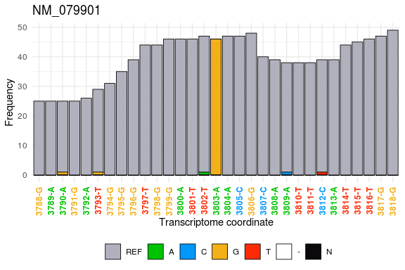

# txtools

<!-- badges: start -->

[](https://github.com/AngelCampos/txtools)
<!-- badges: end -->

## Description

**txtools** is a package that processes genome aligned RNA-seq data into
transcriptomic-oriented data.tables (DT), enabling a quick and
simplified analysis, as well as close inspection of summary metrics per
transcript, at nucleotide resolution. A quick example of its
capabilities is shown bellow.

## Quick example

As an example we will use the ‘Pasilla’ experiment data (from its own
package) which contains a BAM file for the paired-end alignments of a
*D. melanogaster* RNA-seq experiment on chromosome 4, along with a FASTA
file comprising the genome sequence for the same chromosome.

Using txtools we can load the **genome** (FASTA), the **gene
annotation** (BED-12), and the **RNA-seq reads alignment** (BAM) files
into R with ease.

``` r
# Load packages
library(txtools)
library(pasillaBamSubset)

# Getting paths to files
BED_file <- tx_dm3_geneAnnot()
FASTA_file <- dm3_chr4()
PE_BAM_file <- untreated3_chr4()

# Loading gene annotation, genome, and alignments into R.
dm3_geneAnnot <- tx_load_bed(BED_file)
dm3_genome <- tx_load_genome(FASTA_file)
dm3_PEreads <- tx_load_bam(file = PE_BAM_file, pairedEnd = T, loadSeq = T)
```

Then we process the alignments to their transcriptomic versions using
the `tx_reads()` function, and summarize the alignments into a DT that
contains coverage, and nucleotide frequency count data using the
`tx_makeDT_covNucFreq()`function.

``` r
reads_SE <- tx_reads(reads = dm3_PEreads, 
                     geneAnnot = dm3_geneAnnot, 
                     withSeq = T, 
                     nCores = 10, 
                     minReads = 1)
#> Processing 75409 reads, using 10 gene models. 
#> 12563 reads overlap 10 gene models 
#> Filtering reads by gene model... 
#> Processing sequences. This may take several minutes depending on geneAnnot size ... 
#> Output contains: 12252 unique reads in 10 gene models

DT <- tx_makeDT_covNucFreq(reads_SE, geneAnnot = dm3_geneAnnot, genome = dm3_genome)
```

The resulting DT comprise all summarized information from the RNA-seq
reads aligned to the genome and contained within the genes in the gene
annotation (this example consists of only the top 10 expressed genes).
For more information on the columns of DT consult the
`tx_makeDT_covNucFreq()` documentation.

To extend the base metrics that the `tx_makeDT_*()` functions provide
txtools provides the `tx_add_*()` functions family. One example of such
functions is `tx_add_diffNucToRefRatio()` which calculates the ratio of
nucleotide counts different to the reference sequence. Using these
metric we can easily spot locations in which RNA transcripts sequence is
different from that of the reference sequence.

``` r
DT <- tx_add_diffNucToRefRatio(DT, addDiffandTotalCols = TRUE)
DT[which(diffToRefRatio > 0.5 & nucTotal > 40),]
#>     chr gencoor strand         gene txcoor refSeq cov start_5p end_3p A C  G T
#> 1: chr4  939355      -    NM_079901   3803      A  90        0      0 0 0 46 0
#> 2: chr4  939355      - NM_001144385   4033      A  90        0      0 0 0 46 0
#> 3: chr4  939355      - NM_001103382   4562      A  90        0      0 0 0 46 0
#>    N -  . diffToRef nucTotal diffToRefRatio
#> 1: 0 0 44        46       46              1
#> 2: 0 0 44        46       46              1
#> 3: 0 0 44        46       46              1
```

Finally, using the `tx_plot_nucFreq()` function we can visualize that
data in the DT at an specific
location.

``` r
tx_plot_nucFreq(DT, gene = "NM_079901", txRange = window_around(3803, 15))
```

<!-- -->

## Installation

You can install the development version from
[GitHub](https://github.com/AngelCampos/txtools) typing in the following
commands in the R console:

``` r
if (!requireNamespace("BiocManager", quietly = TRUE))
    install.packages("BiocManager")

BiocManager::install("AngelCampos/txtools")
```

## Further documentation

## Current limitations:

  - Insertions: txtools is not able to deal with insertions. This is
    mainly because insertions are not part of the original
    trasncriptomic nor genomic reference space as they would alter the
    length of the gene model. This could be an added feature in future
    versions but is not a priority.

  - Potentially long processing times: Loading big BAM files into R
    commonly requires a lot of time, having this in mind txtools
    provides a progress bar to keep users informed about the loading
    status. Most importantly, depending on the ammount of both loaded
    reads and the size of the *Gene Annotation* tx\_reads() processing
    time can take several minutes. A solution to this issue is the use
    of multi-threadding which has been incorporated into tx\_reads() and
    other functions, but such functionality is only available for UNIX
    and MAC OS.

## Additional notes:

  - As many R packages meant for high-throughput data analysis and
    manipulation, using ***txtools*** may require high ammounts of RAM
    memory, depending mainly on the size of BAM files being processed.

## Session Info

``` r
utils::sessionInfo()
#> R version 3.6.0 (2019-04-26)
#> Platform: x86_64-pc-linux-gnu (64-bit)
#> Running under: CentOS Linux 7 (Core)
#> 
#> Matrix products: default
#> BLAS:   /apps/RH7U2/gnu/R/3.6.0_2020/lib64/R/lib/libblas.so.3
#> LAPACK: /apps/RH7U2/gnu/R/3.6.0_2020/lib64/R/lib/libRlapack.so
#> 
#> locale:
#>  [1] LC_CTYPE=en_US.UTF-8       LC_NUMERIC=C              
#>  [3] LC_TIME=en_US.UTF-8        LC_COLLATE=en_US.UTF-8    
#>  [5] LC_MONETARY=en_US.UTF-8    LC_MESSAGES=en_US.UTF-8   
#>  [7] LC_PAPER=en_US.UTF-8       LC_NAME=C                 
#>  [9] LC_ADDRESS=C               LC_TELEPHONE=C            
#> [11] LC_MEASUREMENT=en_US.UTF-8 LC_IDENTIFICATION=C       
#> 
#> attached base packages:
#> [1] stats     graphics  grDevices utils     datasets  methods   base     
#> 
#> other attached packages:
#> [1] pasillaBamSubset_0.24.0 txtools_0.0.0.9009      testthat_2.3.2         
#> [4] devtools_2.3.0          usethis_1.6.1           magrittr_1.5           
#> 
#> loaded via a namespace (and not attached):
#>  [1] bitops_1.0-6                matrixStats_0.56.0         
#>  [3] fs_1.4.1                    RColorBrewer_1.1-2         
#>  [5] httr_1.4.1                  rprojroot_1.3-2            
#>  [7] GenomeInfoDb_1.22.1         tools_3.6.0                
#>  [9] backports_1.1.8             R6_2.4.1                   
#> [11] lazyeval_0.2.2              BiocGenerics_0.32.0        
#> [13] colorspace_1.4-1            withr_2.2.0                
#> [15] tidyselect_1.1.0            prettyunits_1.1.1          
#> [17] processx_3.4.3              compiler_3.6.0             
#> [19] cli_2.0.2                   Biobase_2.46.0             
#> [21] desc_1.2.0                  DelayedArray_0.12.3        
#> [23] plotly_4.9.2.1              rtracklayer_1.46.0         
#> [25] labeling_0.3                scales_1.1.1               
#> [27] callr_3.4.3                 stringr_1.4.0              
#> [29] digest_0.6.25               Rsamtools_2.2.3            
#> [31] rmarkdown_2.3               XVector_0.26.0             
#> [33] pkgconfig_2.0.3             htmltools_0.5.0            
#> [35] sessioninfo_1.1.1           htmlwidgets_1.5.1          
#> [37] rlang_0.4.7                 rstudioapi_0.11            
#> [39] badger_0.0.8                farver_2.0.3               
#> [41] generics_0.0.2              jsonlite_1.6.1             
#> [43] BiocParallel_1.20.1         dplyr_1.0.2                
#> [45] RCurl_1.98-1.2              GenomeInfoDbData_1.2.2     
#> [47] Matrix_1.2-18               munsell_0.5.0              
#> [49] S4Vectors_0.24.4            fansi_0.4.1                
#> [51] lifecycle_0.2.0             stringi_1.5.3              
#> [53] yaml_2.2.1                  SummarizedExperiment_1.16.1
#> [55] zlibbioc_1.32.0             pkgbuild_1.1.0             
#> [57] grid_3.6.0                  parallel_3.6.0             
#> [59] crayon_1.3.4                lattice_0.20-41            
#> [61] Biostrings_2.54.0           knitr_1.28                 
#> [63] ps_1.3.3                    pillar_1.4.6               
#> [65] GenomicRanges_1.38.0        stats4_3.6.0               
#> [67] pkgload_1.1.0               XML_3.99-0.3               
#> [69] glue_1.4.2                  evaluate_0.14              
#> [71] data.table_1.12.8           remotes_2.1.1              
#> [73] BiocManager_1.30.10         vctrs_0.3.4                
#> [75] gtable_0.3.0                purrr_0.3.4                
#> [77] tidyr_1.1.2                 assertthat_0.2.1           
#> [79] ggplot2_3.3.2               xfun_0.15                  
#> [81] viridisLite_0.3.0           dlstats_0.1.3              
#> [83] tibble_3.0.3                rvcheck_0.1.8              
#> [85] GenomicAlignments_1.22.1    plyranges_1.6.10           
#> [87] memoise_1.1.0               IRanges_2.20.2             
#> [89] ellipsis_0.3.1
```
